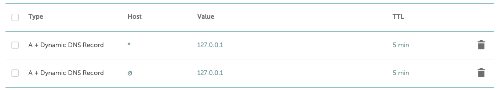
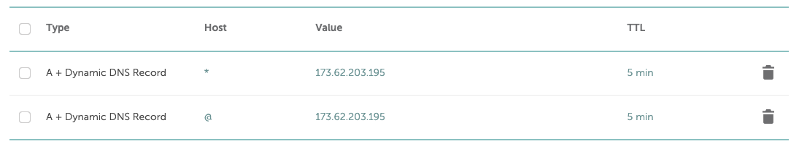
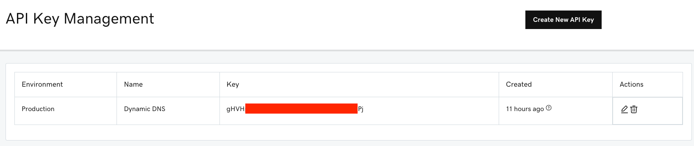
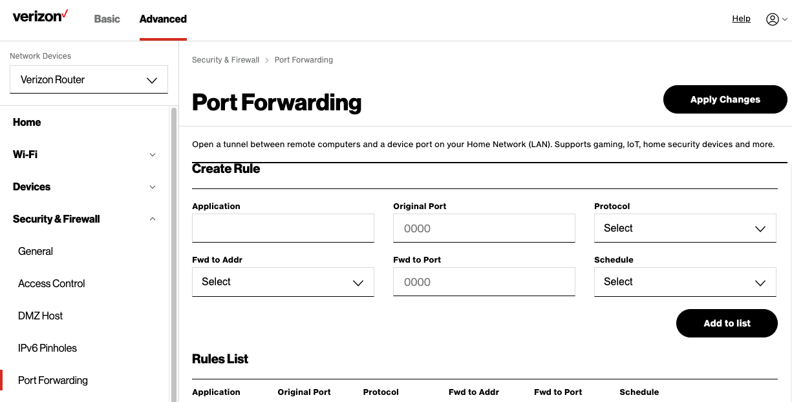
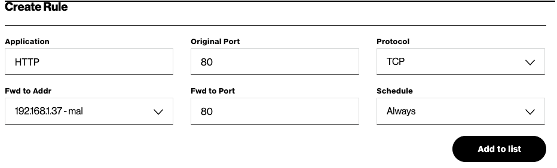
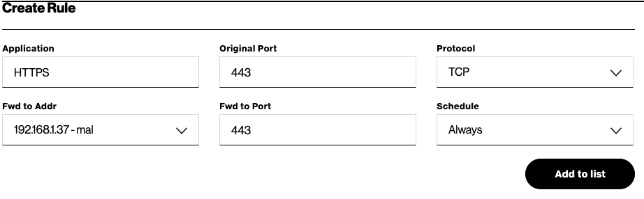
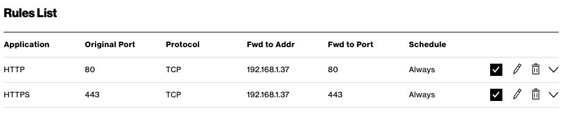

# Configuring a Local WebServer with TLS and Custom Domain

> Some comments on my setup:  
> On Christmas I was gifted the domain `mangoboat.tv` from a friend.  
> This domain is registered it at [namecheap.com](https://www.namecheap.com)  
> My web server is running on an Ubuntu 22.04 machine in my home network.  
> My internet provider is Verizon FIOS  

**My Setup**
* domain: [mangoboat.tv](mangoboat.tv)
* hosted: [namecheap.com](namecheap.com)
* server: Ubuntu 22.04
* webapp: Python Bottle
* router: Verizon Fios CR1000A


## I. Configuring DNS Settings for your Domain

The first thing you will want to do is set up a host for the domain to make it globally reachable!  
To do this, we will create a `DNS A Record` and associate it with your domain.

### 1. Creating a DNS A Record 

Two DNS A records need to be created, one for the host domain and the other for all subdomains.  
We will assign the IP Address as `127.0.0.1` for both records as a placeholder.  
After you create both records, your list should be similar to the following:


---

<details><summary>NameCheap Instructions: (click me to expand)</summary>

The Following link explains how to add a Host A record:
[https://www.namecheap.com/support/knowledgebase/article.aspx/43/11/how-do-i-set-up-a-host-for-dynamic-dns/](https://www.namecheap.com/support/knowledgebase/article.aspx/43/11/how-do-i-set-up-a-host-for-dynamic-dns/)

**Create an `A Record` with the following parameters:**
> record for host domain
```ini
 Type: A + Dynamic DNS Record
 Host: @
Value: 127.0.0.1
  TTL: 5 min
```
**Add a second `A Record`:**
> record for subdomains
```ini
 Type: A + Dynamic DNS Record
 Host: *
Value: 127.0.0.1
  TTL: 5 min
```

</details>

---

<details><summary>GoDaddy Instructions: (click me to expand)</summary>
<p>
  
The Following link explains how to add a Host A record:

[https://www.godaddy.com/help/add-an-a-record-19238](https://www.godaddy.com/help/add-an-a-record-19238)

**Create an `A Record` with the following parameters:**
> record for host domain
```ini
     Type: A
     Host: @
Points to: 127.0.0.1
      TTL: 10 min
```
**Add a second `A Record`:**
> record for subdomains
```ini
     Type: A
     Host: *
Points to: 127.0.0.1
      TTL: 10 min
```
</p>
</details>

---

### 2. Enabling and Configuring Dynamic DNS

Some DNS Registrars support `DDNS` using a client, `API`, or both.

#### NameCheap Instructions
> NameCheap supports both `ddclient` and `API`
> We will use `ddclient`

Follow these steps to enable Dynamic DNS: [https://www.namecheap.com/support/knowledgebase/article.aspx/595/11/how-do-i-enable-dynamic-dns-for-a-domain/](https://www.namecheap.com/support/knowledgebase/article.aspx/595/11/how-do-i-enable-dynamic-dns-for-a-domain/)

Once you have enabled Dynamic DNS, we need to install a Dynamic DNS client on your webserver.
The purpose of this: ...

**Install [ddclient](https://ddclient.net/)**
```yaml
sudo apt install ddclient
```
> The install wizard will ask a bunch of questions, enter anything and move on.
> We will be configuring the config file manually to replace the changes made by the wizard.

**Configure: /etc/ddclient.conf**
```yaml
sudo nano /etc/ddclient.conf
```

/etc/ddclient.conf
```ini
# Configuration file for ddclient generated by debconf
#
# /etc/ddclient.conf

syslog=yes              # log the output to syslog
ssl=yes                 # use ssl when updating IP
use=web, web=dynamicdns.park-your-domain.com/getip # look up external IP from this URL
protocol=namecheap
server=dynamicdns.park-your-domain.com
login=mangoboat.tv
password=2f26XXXXXXXXXXXXXXXXXXXXXXXXXXXX
ttl=300                 # 5 mins
@,*    # wildcard, to update all subdomains, like a.your-domain.com, b.your-domain.com
```

**Configure: /etc/default/ddclient**
```yaml
sudo nano /etc/default/ddclient
```

Set `run_daemon="true"` and `daemon_interval="300"`
/etc/default/ddclient
```ini
# Configuration for ddclient scripts 
# generated from debconf on Thu Feb  9 19:19:59 EST 2023
#
# /etc/default/ddclient

# Set to "true" if ddclient should be run every time DHCP client ('dhclient'
# from package isc-dhcp-client) updates the systems IP address.
run_dhclient="false"

# Set to "true" if ddclient should be run every time a new ppp connection is 
# established. This might be useful, if you are using dial-on-demand.
run_ipup="false"

# Set to "true" if ddclient should run in daemon mode
# If this is changed to true, run_ipup and run_dhclient must be set to false.
run_daemon="true"

# Set the time interval between the updates of the dynamic DNS name in seconds.
# This option only takes effect if the ddclient runs in daemon mode.
daemon_interval="300"

```

**Test Configuration**
```yaml
sudo ddclient -verbose
```
outputs:
```bash
CONNECT:  dynamicdns.park-your-domain.com
CONNECTED:  using HTTP
SENDING:  GET /getip HTTP/1.0
SENDING:   Host: dynamicdns.park-your-domain.com
SENDING:   User-Agent: ddclient/3.8.3
SENDING:   Connection: close
SENDING:
RECEIVE:  HTTP/1.1 200 OK
RECEIVE:  Date: Fri, 10 Feb 2023 00:45:14 GMT
RECEIVE:  Content-Type: text/html
RECEIVE:  Connection: close
RECEIVE:  CF-Cache-Status: DYNAMIC
RECEIVE:  Server: cloudflare
RECEIVE:  CF-RAY: 7970d2222b938c8f-EWR
RECEIVE:  alt-svc: h3=":443"; ma=86400, h3-29=":443"; ma=86400
RECEIVE:
RECEIVE:  173.62.203.195
SUCCESS:  updating *: good: IP address set to 173.62.203.195
SUCCESS:  updating @: good: IP address set to 173.62.203.195
```

**Restart the ddclient service**
```yaml
sudo systemctl restart ddclient.service
```

Check the status:
```yaml
sudo systemctl status ddclient.service
```
outputs:
```bash
   Loaded: loaded (/etc/init.d/ddclient; generated)
   Active: active (running) since Thu 2023-02-09 19:51:32 EST; 21s ago
     Docs: man:systemd-sysv-generator(8)
  Process: 16408 ExecStop=/etc/init.d/ddclient stop (code=exited, status=0/SUCCESS)
  Process: 16414 ExecStart=/etc/init.d/ddclient start (code=exited, status=0/SUCCESS)
    Tasks: 1 (limit: 4915)
   CGroup: /system.slice/ddclient.service
           └─16453 ddclient - sleeping for 280 seconds

Feb 09 19:51:31 mal systemd[1]: Stopping LSB: Update dynamic domain name service entries...
Feb 09 19:51:32 mal systemd[1]: Stopped LSB: Update dynamic domain name service entries.
Feb 09 19:51:32 mal systemd[1]: Starting LSB: Update dynamic domain name service entries...
Feb 09 19:51:32 mal systemd[1]: Started LSB: Update dynamic domain name service entries.
```

**Now Check your DNS Records**
> If all went well, the IP Addresses should have changed from `127.0.0.1`



#### GoDaddy Instructions
> GoDaddy does not support `ddclient` *I may add this later as ddclient is open source*.
> We will use the GoDaddy `API`

**Go to [https://developer.godaddy.com/keys](https://developer.godaddy.com/keys) and Register a New Key**
> copy your `apiKey` and `secret` and save for later  


For setting up `Dynamic DNS` we will use this NodJS tool **godaddy-dns**
website: [https://lmammino.github.io/godaddy-dns/](https://lmammino.github.io/godaddy-dns/)
github: [https://github.com/lmammino/godaddy-dns](https://github.com/lmammino/godaddy-dns)

**Install godaddy-dns**
```yaml
npm install --global godaddy-dns
```

**Edit the Config File**
```yaml
nano $HOME/.godaddy-dns.json
```

$HOME/.godaddy-dns.json
```json
{
  "apiKey": "gHVHXXXXXXXX_XXXXXXXXXXXXXXXXXXXXXXXX",
  "secret": "XXXXXXXXXXXXXXXXXXXXXX",
  "domain": "mangoboat.tv",
  "records": [
    {"type": "A", "name": "@", "ttl": 600},
    {"type": "A", "name": "*", "ttl": 600}
  ]
}
```

**Locate the `godaddy-dns` binary**
```yaml
which godaddy-dns
```
outputs:
```bash
/usr/bin/godaddy-dns
```

Now we create a Cron Job for `godaddy-dns` to run every 5 minutes.

**Create Cron**
```yaml
crontab -e
```

**Add the following line to this file and save**
> be sure to use your `godaddy-dns` binary path from before
```ini
*/5 * * * * /usr/bin/godaddy-dns > /var/log/godaddy-dns.log 2>&1
```

**Wait 5 minutes and Check your DNS Records**
> If all went well, the IP Addresses should have changed from `127.0.0.1` to your external IP.


## II. Configure Firewall - Forward Ports 80 and 443

My Verizon FIOS router has an IP address of `192.168.1.1`

**Login to your Router and go to Port Forwarding settings**
For my router, port forwarding is located at: `Advanced > Security & Firewall > Port Forwarding`
https://192.168.1.1/#/adv/firewall/portforward


**Create a rule for `PORT 80` and click the button `Add to list`**
> My webserver IP = 192.168.1.37


**Create a rule for `PORT 443` and click the button `Add to list`**
> My webserver IP = 192.168.1.37


**Then click the `Apply Changes` button and you should see both rules:**


## III. Setup NGINX Proxy, Certbot, and SSL Certificates
> I have 3 webservers that I will setup to share the same SSL certificate.
> All 3 webservers are running on my LAN on three different machines (each have their own IP address).
> 
> Goal for setup:
> 192.168.1.37:5000  (backend)   -> mangoboat.tv
> 192.168.1.214:8282 (tautulli)  -> tautulli.mangoboat.tv
> 192.168.1.44:8181  (tautulli2) -> tautulli2.mangoboat.tv

### III.a Install NGINX and CertBot

**Install NGINX prerequisites**
```yaml
sudo apt install curl gnupg2 ca-certificates lsb-release ubuntu-keyring
```

**Get the official signing key from Nginx**
```yaml
curl https://nginx.org/keys/nginx_signing.key | gpg --dearmor | sudo tee /usr/share/keyrings/nginx-archive-keyring.gpg >/dev/null
```

**Register the Nginx Repository**
```yaml
echo "deb [signed-by=/usr/share/keyrings/nginx-archive-keyring.gpg] http://nginx.org/packages/ubuntu `lsb_release -cs` nginx" | sudo tee /etc/apt/sources.list.d/nginx.list
```

**Update Ubuntu Sources**
```yaml
sudo apt update
```

**Install NGINX**
```yaml
sudo apt install nginx
```

**Start NGINX**
```yaml
sudo systemctl start nginx
```

**Update snapd**
```yaml
sudo snap install core; sudo snap refresh core
```

**Install Certbot**
```yaml
sudo snap install --classic certbot
```

**Link Certbot**
```yaml
sudo ln -s /snap/bin/certbot /usr/bin/certbot
```

### III.b Setup NGINX

**Create an NGINX config file for your site: mangoboat.tv**
```yaml
sudo nano /etc/nginx/sites-available/mangoboat.tv
```
Add configs:
```nginx
# Server Config for mangoboat.tv, tautulli.mangoboat.tv, and tautulli2.mangoboat.tv
server {
    listen 80;

    server_name mangoboat.tv www.mangoboat.tv;

    location / {
        proxy_pass http://127.0.0.1:5000;
        proxy_set_header Host $host;
        proxy_set_header X-Real-IP $remote_addr;
        proxy_set_header X-Forwarded-For $proxy_add_x_forwarded_for;

        # WebSocket Support
        proxy_http_version 1.1;
        proxy_set_header Upgrade $http_upgrade;
        proxy_set_header Connection "upgrade";
    }

}

server {
    listen 80;

    server_name tautulli.mangoboat.tv www.tautulli.mangoboat.tv;

    location / {
        proxy_pass http://192.168.1.214:8282;
        proxy_set_header Host $host;
        proxy_set_header X-Real-IP $remote_addr;
        proxy_set_header X-Forwarded-For $proxy_add_x_forwarded_for;

        # WebSocket Support
        proxy_http_version 1.1;
        proxy_set_header Upgrade $http_upgrade;
        proxy_set_header Connection "upgrade";
    }
}

server {
    listen 80;

    server_name tautulli2.mangoboat.tv www.tautulli2.mangoboat.tv;

    location / {
        proxy_pass http://192.168.1.44:8181;
        proxy_set_header Host $host;
        proxy_set_header X-Real-IP $remote_addr;
        proxy_set_header X-Forwarded-For $proxy_add_x_forwarded_for;

        # WebSocket Support
        proxy_http_version 1.1;
        proxy_set_header Upgrade $http_upgrade;
        proxy_set_header Connection "upgrade";
    }
}

```

**Now link your site config**
```yaml
sudo ln -s /etc/nginx/sites-available/mangoboat.tv /etc/nginx/sites-enabled/mangoboat.tv
```

**Check NGINX Config**
```yaml
sudo nginx -t
```
outputs:
```
nginx: the configuration file /etc/nginx/nginx.conf syntax is ok
nginx: configuration file /etc/nginx/nginx.conf test is successful
```

**Restart NGINX**
```yaml
sudo systemctl restart nginx
```

**Now check your domains in a browser :)**
> For me, that would be [mangoboat.tv](mangoboat.tv), [tautulli.mangoboat.tv](tautulli.mangoboat.tv), and [tautulli2.mangoboat.tv](tautulli2.mangoboat.tv)

Your domains should work but the browser may alert you that they are not secure!

### IV. Generate SSL Certificate for your Domains

**Stop NGINX Service**
```yaml
sudo systemctl stop nginx
```

**Generate SSL Certificate**
```yaml
sudo certbot --nginx -d mangoboat.tv -d www.mangoboat.tv -d tautulli.mangoboat.tv -d www.tautulli.mangoboat.tv -d tautulli2.mangoboat.tv -d www.tautulli2.mangoboat.tv
```
outputs:
```bash
Saving debug log to /var/log/letsencrypt/letsencrypt.log
Requesting a certificate for mangoboat.tv and 5 more domains

Successfully received certificate.
Certificate is saved at: /etc/letsencrypt/live/mangoboat.tv/fullchain.pem
Key is saved at:         /etc/letsencrypt/live/mangoboat.tv/privkey.pem
This certificate expires on 2023-05-11.
These files will be updated when the certificate renews.
Certbot has set up a scheduled task to automatically renew this certificate in the background.

Deploying certificate
Successfully deployed certificate for mangoboat.tv to /etc/nginx/sites-enabled/mangoboat.tv
Successfully deployed certificate for www.mangoboat.tv to /etc/nginx/sites-enabled/mangoboat.tv
Successfully deployed certificate for tautulli.mangoboat.tv to /etc/nginx/sites-enabled/mangoboat.tv
Successfully deployed certificate for www.tautulli.mangoboat.tv to /etc/nginx/sites-enabled/mangoboat.tv
Successfully deployed certificate for tautulli2.mangoboat.tv to /etc/nginx/sites-enabled/mangoboat.tv
Successfully deployed certificate for www.tautulli2.mangoboat.tv to /etc/nginx/sites-enabled/mangoboat.tv
Congratulations! You have successfully enabled HTTPS on https://mangoboat.tv, https://www.mangoboat.tv, https://tautulli.mangoboat.tv, https://www.tautulli.mangoboat.tv, https://tautulli2.mangoboat.tv, and https://www.tautulli2.mangoboat.tv

- - - - - - - - - - - - - - - - - - - - - - - - - - - - - - - - - - - - - - - -
If you like Certbot, please consider supporting our work by:
 * Donating to ISRG / Let's Encrypt:   https://letsencrypt.org/donate
 * Donating to EFF:                    https://eff.org/donate-le
- - - - - - - - - - - - - - - - - - - - - - - - - - - - - - - - - - - - - - - -
```

**Check NGINX Config**
```yaml
sudo nginx -t
```
outputs:
```
nginx: the configuration file /etc/nginx/nginx.conf syntax is ok
nginx: configuration file /etc/nginx/nginx.conf test is successful
```

**Restart NGINX**
```yaml
sudo systemctl restart nginx
```
> If you get an error, restart using the following commands:
> ```yaml
> sudo pkill -f nginx & wait $!
> sudo systemctl restart nginx
> ```

**Finally, check your domains :)**
> For me, that would be [https://mangoboat.tv](https://mangoboat.tv), [https://tautulli.mangoboat.tv](https://tautulli.mangoboat.tv), and [https://tautulli2.mangoboat.tv](https://tautulli2.mangoboat.tv)
